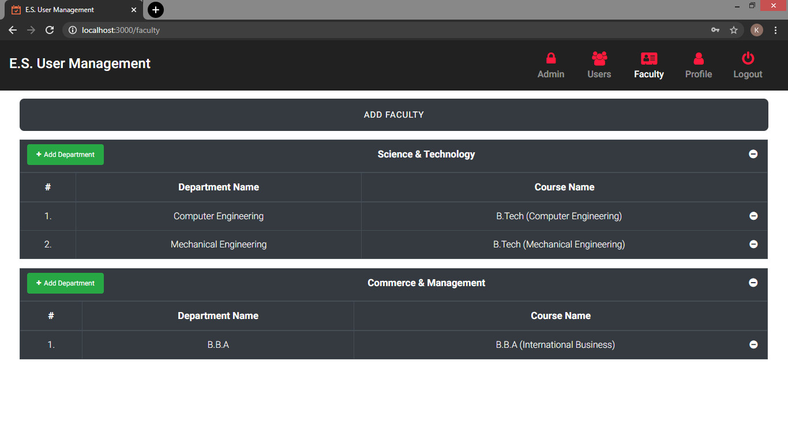
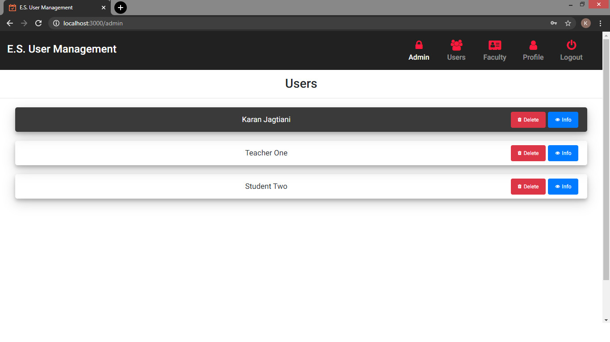
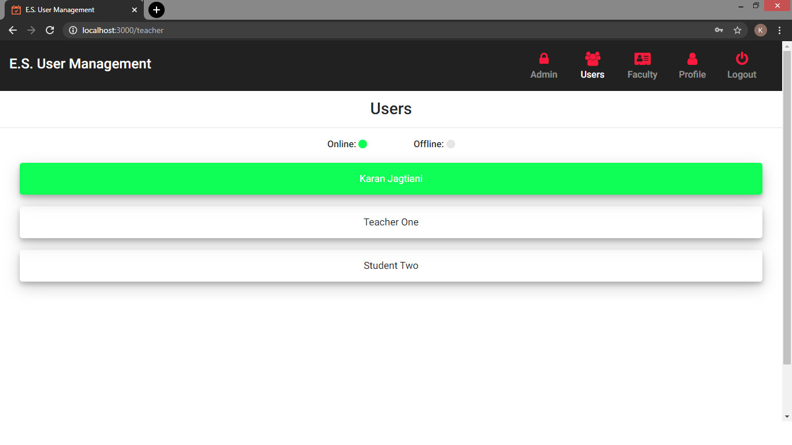
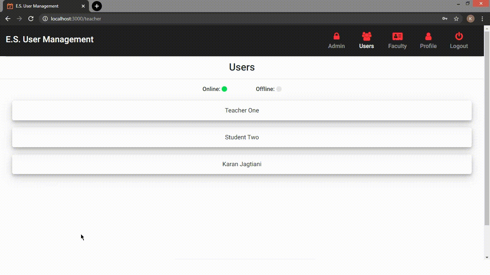

# Student-Software-Management-System
A system than can keep track of every user's utilization of a software in real-time, built using the MEAN Stack and Python.

## Description
This system is built for a University. The teachers can keep track of every student who is utilizing the software for which this system is deployed. When the student opens the software, a GUI pops up asking the student to sign in. Unless the user signs in, they cannot use the software. After closing the software, the student is automatically logged out.

## Technologies

* Mongo DB
* Express JS
* Angular
* Node JS
* Tkinter (Python)
* Web Sockets
* JSON Web Tokens for User Authentication

## Pages on Angular Application

### 1) Login Page

### 2) Profile Page

### 3) Add Faculty Page
New faculties within the university can be added. Withing each faculty, departments can be added.



### 4) Registration Page
Based on the added faculties and department(s) within that faculty, student can create their account.


### 5) Users Information Page
Here, the admin can view information and delete accounts of both students and teachers.



### 6) Students Information Page
The teacher can see the students who are online and currently using the software being tracked.


## Types of Users

* ### Student
  Only has access to Login, Registration, and Profile page.
* ### Teacher
  Has access to the pages available to the student as well as Student's Information Page (Teacher).
* ### Admin
  Has access to all pages. Admin can view and delete user accounts.

## Working Example
For demonstration, notepad is chosen as the sofware to be tracked.



## Setup

1. Install this repository on your machine by downloading the zip file or running this command:

```
git clone https://github.com/KaranJagtiani/Student-Software-Management-System.git
```

2. Run this command in "angular-src" & "node-app" directory for installing the necessary node modules:

```
npm install
```

3. Make sure MongoDB is running:

```
mongod
```

## Usage

1. Run the python script (main.py) or create a executable using cx_Freeze by running this command:

```
python setup.py build
```

2. Run the Node server using this command:
Note: The production files of angular are already deployed to the Node server.

```
node app.js
```

3. To Start the angular server, use this command:
(optional)
```
ng serve
```

## Have Fun!!
